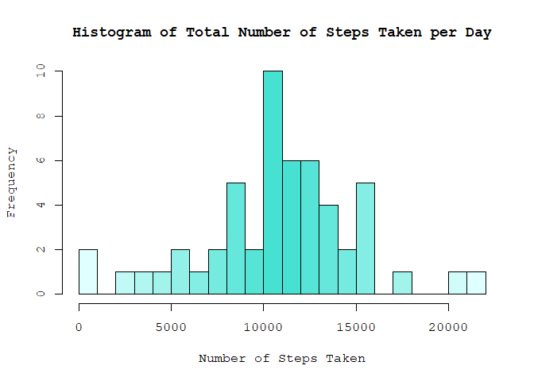
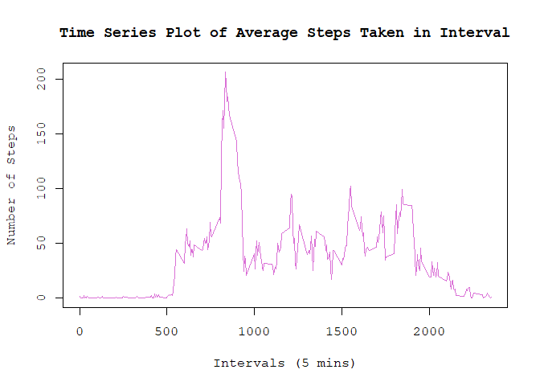
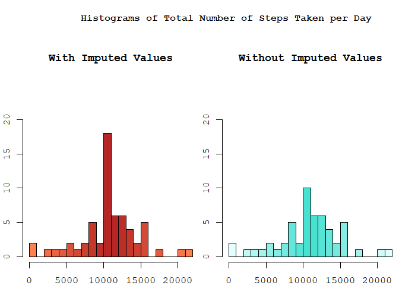
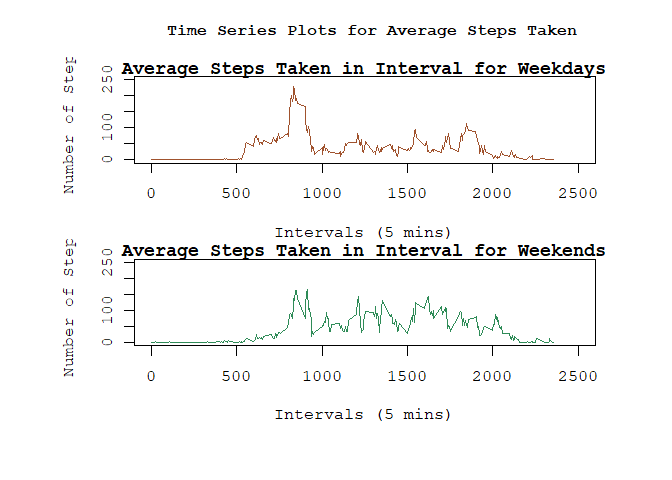

<style type="text/css">
  body{
  font-family: times, serif;
  font-size: 14pt;
}
</style>


## Loading and preprocessing the data

```r
unzip("activity.zip")
measuredData <- read.csv("activity.csv", colClasses=c("numeric", "Date", "numeric"))
```

As the following 2 questions ask to ignore the missing/NA values, removing NA values and converting the list to a data.table object


```r
library(data.table)
setDT(measuredData)
nonImputedData <- copy(measuredData)
nonImputedData <- nonImputedData[!is.na(nonImputedData$steps),]
```


## What is mean total number of steps taken per day?

* Grouping the data by dates and summing over individual dates gives the total number of steps taken each day. These summations for each day can then be used to calculate the mean and median number of steps each day.
The histogram shows the frequency of the total number of steps taken per day across all days


```r
totalStepsDaily <- nonImputedData[ ,list(steps=sum(steps)), by=date]
cat(" Mean of total steps per day =", mean(totalStepsDaily[["steps"]]), "\n",
    "Median of total steps per day =", median(totalStepsDaily[["steps"]]) )
```

```
##  Mean of total steps per day = 10766.19 
##  Median of total steps per day = 10765
```

```r
paletteCyan <- colorRampPalette(c('lightcyan', 'turquoise', 'lightcyan'));
hist(totalStepsDaily$steps, breaks=30, xlab="Number of Steps Taken", 
     main="Histogram of Total Number of Steps Taken per Day",
     col=paletteCyan(22), family="mono")
```

<!-- -->


## What is the average daily activity pattern?

* Similar to the previous operation, the data is groups but this time according to the intervals, and the mean of all the steps for each interval is calculated 


```r
nonImputedData <- copy(measuredData)
nonImputedData <- nonImputedData[!is.na(nonImputedData$steps),]
avgStepsDaily <- nonImputedData[ ,list(steps=mean(steps)), by=interval]
head(avgStepsDaily)
```

```
##    interval     steps
## 1:        0 1.7169811
## 2:        5 0.3396226
## 3:       10 0.1320755
## 4:       15 0.1509434
## 5:       20 0.0754717
## 6:       25 2.0943396
```

```r
plot(x=avgStepsDaily$interval, y=avgStepsDaily$steps, type="l",
     main="Time Series Plot of Average Steps Taken in Interval",
     ylab="Number of Steps", xlab="Intervals (5 mins)",
     col="orchid", lwd=1, family="mono")
```

<!-- -->


* The 5-minute interval, on average across all the days in the dataset, that contains the maximum number of steps is


```r
print(avgStepsDaily[which.max(avgStepsDaily[["steps"]]),])
```

```
##    interval    steps
## 1:      835 206.1698
```


## Imputing missing values

* To analyse how imputing values will affect the output, we need to understand basic characteristics of the NA values


```r
colSums(is.na(measuredData))
```

```
##    steps     date interval 
##     2304        0        0
```

```r
nonImputedData <- copy(measuredData)
datesUniqueNonNA <- unique(nonImputedData[!is.na(nonImputedData$steps),]$date)

##get unique values for number of rows in groups of data divided by date
unique(nonImputedData[, .N, by=.(date)]$N) 
```

```
## [1] 288
```

```r
datesUniqueNA <- unique(nonImputedData[is.na(nonImputedData$steps),]$date)
any(datesUniqueNA %in% datesUniqueNonNA)
```

```
## [1] FALSE
```

* Above operations show that 
i. All the Days have exactly 288 intervals
ii. Therefore for days where there are NA values, all of the entries for those days are NA. 

Hence we can predict that imputing these NA values will drive the overall observations towards the mean.

* Defining a function to get the mean of a groups of values, this will help in getting mean of the interval of the NA value which can then be imputed. Impute values using mean are rounded are steps cannot be decimal values


```r
impute <- function(x) replace(x, is.na(x), round(mean(x, na.rm = TRUE)))
imputedData <- copy(measuredData)
imputedData[, steps := impute(steps), by = interval]
head(imputedData)
```

```
##    steps       date interval
## 1:     2 2012-10-01        0
## 2:     0 2012-10-01        5
## 3:     0 2012-10-01       10
## 4:     0 2012-10-01       15
## 5:     0 2012-10-01       20
## 6:     2 2012-10-01       25
```

* Creating a Histogram of total number of steps taken each day and calculating the mean and median thereof using the imputed data


```r
totalStepsDailyImputed <- imputedData[ ,list(steps=sum(steps)), by=date]
cat(" Mean of total steps per day =", mean(totalStepsDailyImputed[["steps"]]), "\n",
    "Median of total steps per day =", median(totalStepsDailyImputed[["steps"]]) )
```

```
##  Mean of total steps per day = 10765.64 
##  Median of total steps per day = 10762
```

```r
par(mfrow = c(1, 2), mar = c(2,2,10,0))
paletteCoral <- colorRampPalette(c('coral', 'firebrick', 'coral'));
hist(totalStepsDailyImputed$steps, breaks=20, xlab="Number of Steps Taken", ylim=c(0, 20),
     main="With Imputed Values",
     col=paletteCoral(22), family="mono")
paletteCyan <- colorRampPalette(c('lightcyan', 'turquoise', 'lightcyan'));
hist(totalStepsDaily$steps, breaks=20, xlab="Number of Steps Taken", ylim=c(0, 20),
     main="Without Imputed Values",
     col=paletteCyan(22), family="mono")
mtext("Histograms of Total Number of Steps Taken per Day", side = 3, line = -2, outer = T,
      adj=0.75, family="serif", font=11)
```

<!-- -->

1. Comparing the 2 histograms, we see that frequency of all values increases, which is expected due increase in the reading of steps due to imputing the NA values
2. Filling the NA values with means across the intervals (rounded) affects the overall result very slightly.


## Are there differences in activity patterns between weekdays and weekends?

* The 'format' function in conjunction with '%u' gives values from 1 to 7 when applied on the date column where 1 represents Monday and 7 represents Sunday. We use this as a condition to populate the 'day' column which stores either "weekday" or "weekend" accordingly


```r
imputedDatawithDay <- imputedData[ , `:=` (day = ifelse(format(imputedData$date, "%u") %in% c(1, 2, 3, 4, 5), "weekday", "weekend"))]
weekdayMean <- subset(imputedDatawithDay, day == "weekday")[ ,list(steps=mean(steps)), by=interval]
weekendMean <- subset(imputedDatawithDay, day == "weekend")[ ,list(steps=mean(steps)), by=interval]
par(mfrow=c(2, 1), mar=c(4, 4, 1, 1), oma=c(3,3,3,3))
plot(weekdayMean$interval, weekdayMean$steps, type="l",
     main="Average Steps Taken in Interval for Weekdays",
     xlab="Intervals (5 mins)", ylab="Number of Steps", family="mono",
     col="sienna", lwd=1.2, ylim=c(0, 250), xlim=c(0, 2500))
plot(weekendMean$interval, weekendMean$steps, type="l",
     main="Average Steps Taken in Interval for Weekends",
     xlab="Intervals (5 mins)", ylab="Number of Steps", family="mono",
     col="seagreen", lwd=1.2, ylim=c(0, 250), xlim=c(0, 2500))
mtext("Time Series Plots for Average Steps Taken", side = 3, line = 1, outer = T,
      adj=0.75, family="serif", font=11)
```

<!-- -->

* Comparing the above plots we can make the following observations
1. The average number of steps is higher on average in the 5000-10000 intervals on weekdays than on weekends
2. Average number of steps during the 10000-15000 intervals are higher on weekends than on weekdays
3. Average number of steps are more evenly distributed across the intervals from 5000-20000 on weekends than on weekdays which have much more pronounced peaks and higher number of intervals with comparatively less number of steps
